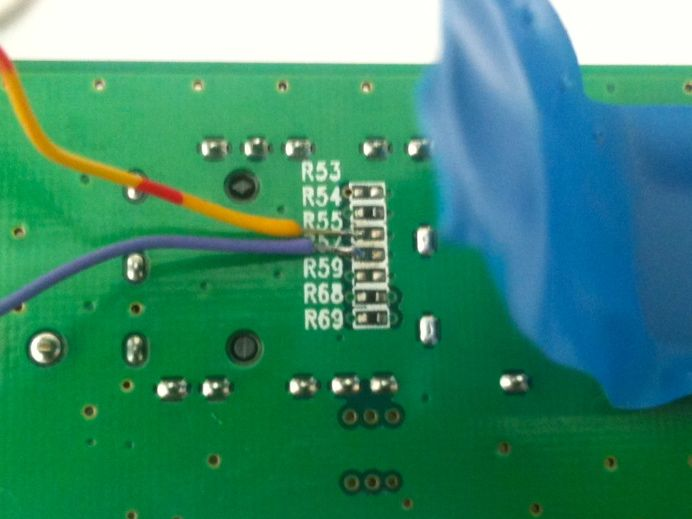

sfpddm
======

Arduino library for interfacing SFP modules and reading DDM information as per SFF-8472. The library is following the standard but is not yet fully compliant, some additional rarely used functions need to be implemented for that.

How it works
------------

The library offers functions that return measurements in the form specified by the standerd. Handles the externally callibrated data as well, performs the necessary calculations and outputs the results as if they were internaly calibrated.

For communication the specified I2C library is internally initialized, the default Arduino I2C library is not reliable enough and can not be used.
Please obtain and install the I2C library by Wayne Truchsess http://dsscircuits.com/articles/arduino-i2c-master-library.html

Hardware connections
-------------
Connect the SFP module to the I2C port of your Arduino. Accessing the I2C port of the SFP module is generally possible only with a SFP cradle attached to a PCB or hacking an existing circuit, such as TP-Link MC220L media converter.

Modification of TP-Link MC220L for accessing SFP management bus (I2C)
-------------
TP-Link MC220L media converter is an Ethernet to SFP converter for use with SFP fibre or copper modules for either 100Mbps or 1Gbps Ethernet communication and can be modified, allowing a connection of an external device sucha as an Arduino to the I2C SFP management bus. 

SFP module 4 and 5 pins are used for I2C communication and can be located on the bottom side of the PCB. There is an array of resistor footprints, most of them unpopulated. Left (orientation normal to the solder mask) resistor pads of footprints R57-SCL and R55-SDA. SFP power supply decoupling and filtering section is located on the top side of the PCB, to the right of the SFP cage. For best noise performance and decoupling of additional circuitry, 3.3V power must be taken from the mid point between the two inductors with markings IR0. Ground should be taken from the capacitor pads C58 of C57.

Detailed instructions can be found in MC220Lmod.pdf document.

Use case
-------------
Monitoring a system with SFP modules, mostly for development purposes only. See the implementation of this library in panstamp.com project.

Function description
-------------
Available in the main library file.
